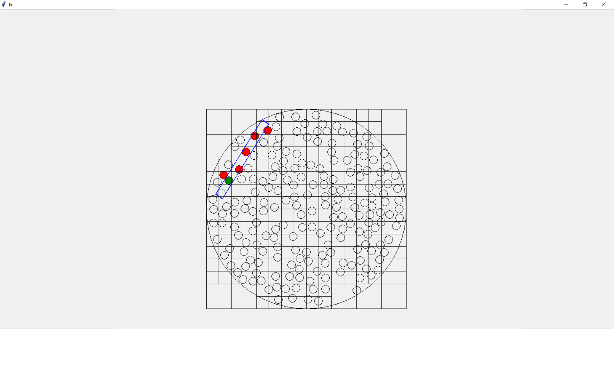
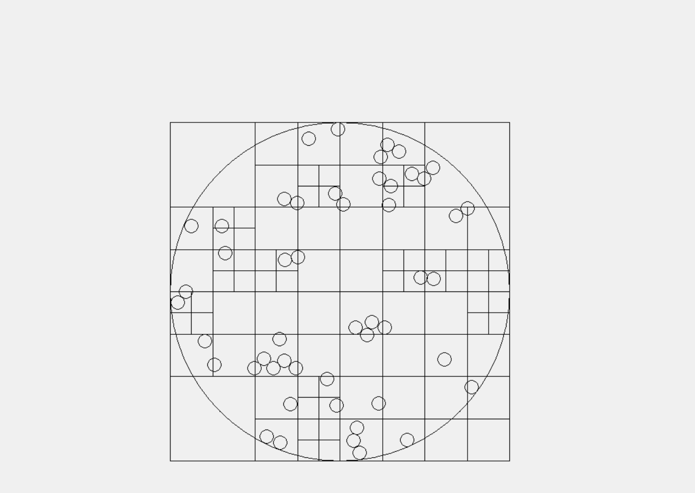

# Overview
This is a program that simulates the random movement of particles. The latters are represented by non-overlapping circles and this condition is ensured with the use of a quadtree.

# Requirements
- Python 3.8

# Demos
## Trajectory of a particle

  
  <figcaption><b>Figure 1. Circle zone with radius equal to 250 pixels containing 200 small circles with radius equal to 10 pixels.</b> The circle with the green outline is the starting position and the green circle is the final position. The blue rectangle represents the the hitbox of the movement of the green circle and the red circles are the obstacles. The squares are the partitions of a quadtree.
  </figcaption>

## Moving particles

  
  
  <figcaption><b>Figure 2. Circle zone with radius equal to 250 pixels containing 50 small circles with radius equal to 10 pixels.</b> The positions of the circles are configured to be updated at the rate of 60 frames per second (this might not be accurate because the "after" function of tkinter is used to animate the movement).
  </figcaption>

